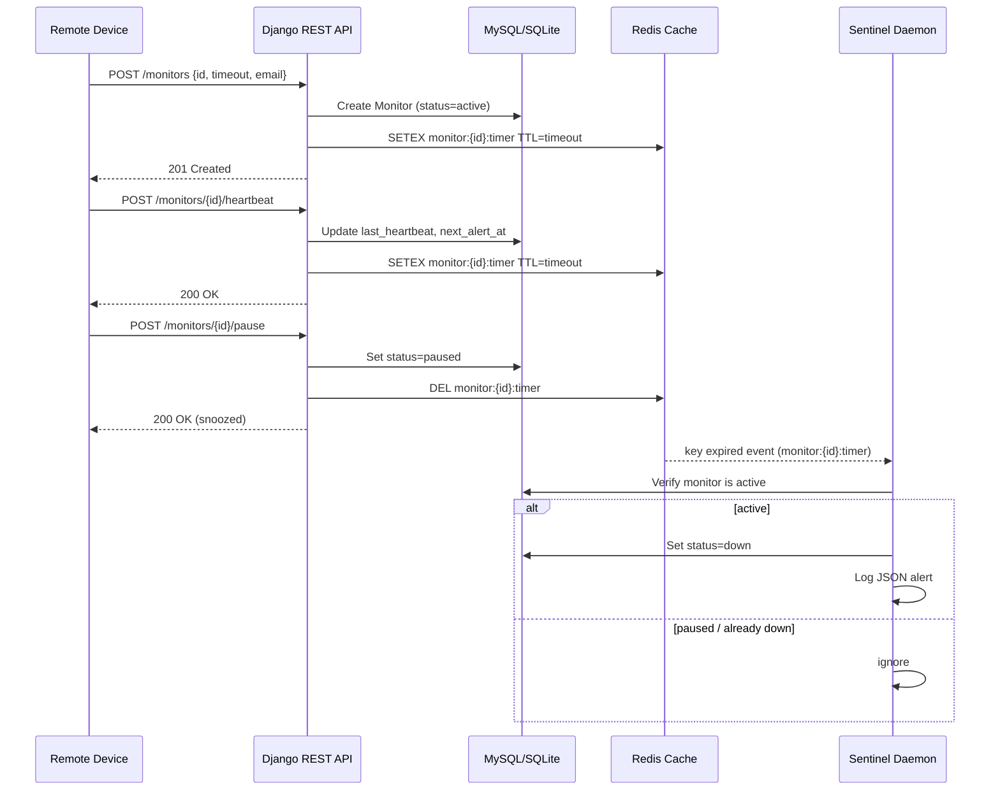

# Pulse-Check-API ("Watchdog" Sentinel) 

## 🎯 Overview
The **Pulse‑Check‑API** is a production‑grade *Dead‑Man’s Switch* built with **Python Django**, **MySQL** (fallback to **SQLite**) and **Redis**.  It lets remote devices register a monitor, send heartbeats, and automatically raises an alert when a device goes silent.

---

## 📚 Table of Contents
1. [Architecture Diagram](#architecture-diagram)
2. [Quick Start (Local Development)](#quick-start-local-development)
3. [API Reference](#api-reference)
4. [Developer’s Choice – Live Dashboard](#developers-choice‑live-dashboard)
5. [Testing](#testing)

---

## Architecture Diagram
Below is a **Mermaid sequence diagram** that shows the flow from device registration → heartbeat → pause → alert.

---

## Quick Start (Local Development)
### Prerequisites
- **Python 3.10+**
- **Redis** running on `localhost:6379`
- **MySQL** (optional, runs on `localhost:3306`). If MySQL is not available the app will fall back to SQLite automatically.

### 1️⃣ Clone & Navigate
```bash
cd pulse
```
### 2️ Set Up a Virtual Environment
```bash
python -m venv venv
# Windows PowerShell
.\\venv\\Scripts\\Activate.ps1
# macOS/Linux
source venv/bin/activate
```
### 3️ Install Dependencies
```bash
pip install -r requirements.txt
# (includes Django, redis, pymysql, python‑dotenv)
```
### 4️ Initialise the Database
```bash
python setup_db.py    # Detects MySQL or creates a local SQLite DB
python manage.py migrate
```
### 5️ Run the Sentinel Daemon (Terminal 1)
```bash
python manage.py run_sentinel
```
### 6️ Run the Django Server (Terminal 2)
```bash
python manage.py runserver
```
Open **http://127.0.0.1:8000/** in a browser – you’ll see the glass‑morphic live dashboard.
---

## API Reference
All endpoints accept and return JSON. CSRF is disabled for remote devices.
### 1️ Register a Monitor
- **POST** `/monitors`
- **Body**:
```json
{ "id": "device-123", "timeout": 60, "alert_email": "admin@critmon.com" }
```
- **Responses**: `201 Created` (or `200 OK` if the monitor already exists).

### 2️ Heartbeat (Reset Timer)
- **POST** `/monitors/{id}/heartbeat`
- **Success**: `200 OK` with updated timestamps.
- **Error**: `404 Not Found` if the monitor does not exist.

### 3️ Pause / Snooze
- **POST** `/monitors/{id}/pause`
- **Success**: `200 OK` (monitor status becomes `paused`).

### 4️ Alert (Internal)
When Redis TTL expires, the daemon logs a JSON alert to stdout, e.g.:
```json
{"ALERT": "Device device-123 is down!", "time": "2026‑05‑28T09:05:00Z"}
```
---

## Developer’s Choice – Live Dashboard 
A premium UI shows every monitor in real‑time, with countdown timers, pause/unpause buttons, and a scrolling alert feed.  It makes testing and demoing the API a breeze.
---

## Testing
```bash
python manage.py test
```
The suite covers registration, heartbeat, pause, and the alert flow.
---
