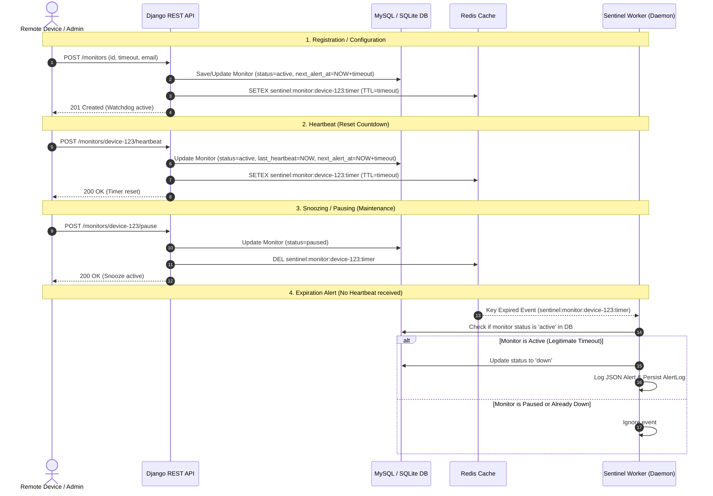
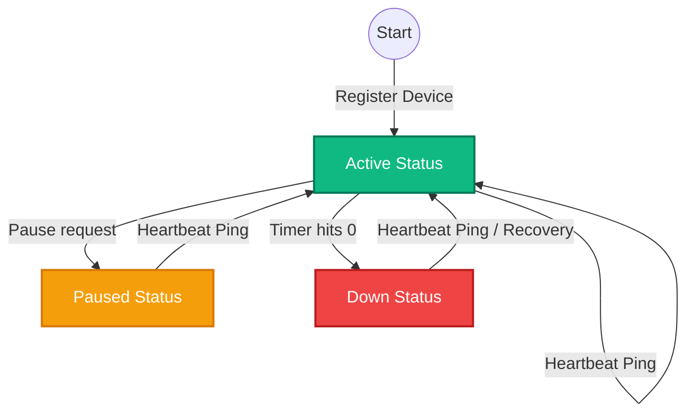

# Pulse-Check-API ("Watchdog" Sentinel) 🛡️

A robust, event-driven, production-grade **Dead Man's Switch API** ("Watchdog" Sentinel) built using **Python Django**, **MySQL** (with automated SQLite fallback), and **Redis** for high-speed stateful countdown timers. Designed for *CritMon Servers Inc.* to monitor remote infrastructure (solar farms, weather stations) and trigger instant alerts if heartbeats stop.

---

## 1. System Architecture & Flows

The Watchdog Sentinel utilizes a hybrid, event-driven architecture combining **Redis Keyspace Notifications (`Ex`)** for instant event-driven reactivity and a **Dual-Safety SQL background loop** for bulletproof resilience and self-healing.

### A. Sequence Diagram


### B. State Transition Flowchart


---

## 2. Developer's Choice: Live Status Dashboard 🎨

To provide maximum robustness and testing ergonomics, we built a **Live Glassmorphic Status Control Dashboard**. 

### Why this is a game-changer:
* **Interactive Testing Playground**: Instead of writing complex `curl` loops or Python scripts to see if the watchdog triggers, engineers can register devices, pause them, trigger heartbeats, and watch countdowns in real-time directly from a beautiful web UI.
* **Client-Side Real-Time Countdown Engine**: The dashboard computes and displays the seconds remaining for each active device. Badges turn warning-orange and warning-red as devices approach expiration.
* **Hot AJAX Action Triggers**: Triggers `Heartbeat` and `Pause` API calls asynchronously. The UI reacts instantly (resetting timers, toggling buttons, and shifting states) without a single page reload.
* **Live Alerts Log Feed**: A database-backed rolling log panel displays critical watchdog events the second they fire.
* **Toast Notification Hub**: Shows beautiful success, warning, and danger toast notifications for all system events.

---

## 3. Setup Instructions 🚀

This project features a **self-healing environment prober**. If you do not have MySQL configured or running locally, Django will **automatically fall back to a local SQLite database** and continue running perfectly out of the box!

### Prerequisites
* Python 3.10+
* Redis Server (running on localhost `6379`)
* MySQL (Optional, running on localhost `3306`)

### Step 1: Clone & Navigate
```bash
git clone <your-fork-url>
cd hacks
```

### Step 2: Create and Activate Virtual Environment
```bash
python -m venv venv
# On Windows (PowerShell):
.\venv\Scripts\Activate.ps1
# On Linux/macOS:
source venv/bin/activate
```

### Step 3: Install Dependencies
```bash
pip install -r requirements.txt
# (or manual install)
pip install django redis pymysql python-dotenv
```

### Step 4: Run the Auto-Setup Database Script
This script probes your local MySQL for common credentials, creates the database automatically, and configures `.env`. If connection is refused, it configures a template `.env` and defaults gracefully to SQLite!
```bash
python setup_db.py
```

### Step 5: Apply Migrations
```bash
python manage.py migrate
```

### Step 6: Start the Sentinel Watchdog Daemon (Terminal 1)
Start the background worker that listens to Redis timer expirations and handles dual-safety polling:
```bash
python manage.py run_sentinel
```

### Step 7: Start the Django Web Server (Terminal 2)
```bash
python manage.py runserver
```

Now, open your browser and navigate to **`http://127.0.0.1:8000/`** to explore the Sentinel Dashboard!

---

## 4. API Documentation 📡

All endpoints use JSON payloads. CSRF validation is exempted to allow remote devices and solar-farms to ping freely.

### 1. Register a Monitor
Create a new watchdog timer or update an existing configuration.

* **Endpoint**: `POST /monitors`
* **Request Header**: `Content-Type: application/json`
* **Payload**:
  ```json
  {
    "id": "device-123",
    "timeout": 60,
    "alert_email": "admin@critmon.com"
  }
  ```
* **Success Response (`201 Created` or `200 OK` if updated)**:
  ```json
  {
    "status": "created",
    "message": "Device 'device-123' watchdog active. Monitor registered successfully.",
    "monitor": {
      "id": "device-123",
      "timeout": 60,
      "alert_email": "admin@critmon.com",
      "status": "active",
      "last_heartbeat": "2026-05-28T09:00:00.000Z",
      "next_alert_at": "2026-05-28T09:01:00.000Z"
    }
  }
  ```

#### Example Curl:
```bash
curl -X POST http://127.0.0.1:8000/monitors \
  -H "Content-Type: application/json" \
  -d '{"id": "device-123", "timeout": 60, "alert_email": "admin@critmon.com"}'
```

---

### 2. Send Heartbeat (Reset)
Resets the countdown timer back to the beginning. If the monitor was previously `paused` (snoozed) or `down` (offline), it automatically **unpauses/recovers** and starts tracking again.

* **Endpoint**: `POST /monitors/{id}/heartbeat`
* **Success Response (`200 OK`)**:
  ```json
  {
    "status": "ok",
    "message": "Heartbeat acknowledged for device 'device-123'. Watchdog sentinel reset.",
    "monitor": {
      "id": "device-123",
      "status": "active",
      "last_heartbeat": "2026-05-28T09:04:12.000Z",
      "next_alert_at": "2026-05-28T09:05:12.000Z"
    }
  }
  ```
* **Error Response (`404 Not Found`)**: If the device ID doesn't exist.
  ```json
  {
    "error": "Monitor with ID 'device-999' not found"
  }
  ```

#### Example Curl:
```bash
curl -X POST http://127.0.0.1:8000/monitors/device-123/heartbeat
```

---

### 3. Pause Monitor (Snooze)
Completely pauses monitoring. Alarms are snoozed, active countdowns are removed from Redis, and no alerts will fire.

* **Endpoint**: `POST /monitors/{id}/pause`
* **Success Response (`200 OK`)**:
  ```json
  {
    "status": "paused",
    "message": "Watchdog sentinel paused for device 'device-123'. Snooze active.",
    "monitor": {
      "id": "device-123",
      "status": "paused"
    }
  }
  ```
* **Error Response (`404 Not Found`)**: If the device ID doesn't exist.

#### Example Curl:
```bash
curl -X POST http://127.0.0.1:8000/monitors/device-123/pause
```

---

### 4. Watchdog Sentinel Alert Trigger (Failure State)
When a device's timer reaches 0, the background Sentinel daemon immediately transitions its status to `down`, writes a database alert log, and outputs the following required JSON alert directly to the terminal stdout:

```json
{"ALERT": "Device device-123 is down!", "time": "2026-05-28T09:05:00.000000Z", "reason": "Redis TTL Expired"}
```

---

## 5. Automated Tests 🧪

To execute the automated unit and integration tests:
```bash
python manage.py test
```
The test suite validates:
* Watchdog creation (including bad formats, negative timeouts, empty fields).
* Heartbeats (successful timing resets, 404s, auto-unpauses).
* Pauses (removing Redis keys, database status updates, 404s).
